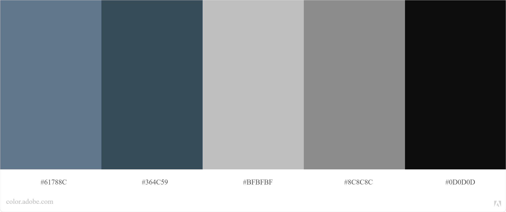

# **CRAFT GINS NI Website** 

[View website on GitHub Pages](https://andrewboyd79.github.io/CraftGinsNI/)

This Craft Gins NI website has been produced by Andrew Boyd as a Milestone 2 Project for the Code Institute’s Full Stack Web Development course.

In the UK, in 2020, gin sales were valued at around £2.6 billion; however, with rising disposable income and changing consumer behaviours, the demand for premium/craft gin is growing. Consumers are devoting more time than ever to researching not only which gin they like, but where, by whom and how the spirit is made.

Northern Ireland currently has a thriving craft gin industry with almost a dozen producers spread across the island; the desire to sample these high-quality products is met by an increasing number of bars and restaurants specialising in serving craft gin. 

The website aims to provide information on each craft gin producers and where best to sample their products. Information on the producer’s history, story, location (detailed on Google maps), range of gins will be included; similar relevant details on each “gin-house” will be included.     It has been designed to set out the information logically and with clear navigation aids to efficiently move through the website.

The user should be taken on a journey of discovery of the craft gins of Northern Ireland.

---

## **Contents**
1. **[UX](#ux)**
    - [Business Goals](#Business-Goals)
    - [Target Audience](#Target-Audience)
    - [User Goals](#User-Goals)
    - [User Stories](#User-Stories)
    - [User Considerations](#User-considerations)
    - [Wireframe diagrams](#Wireframe-diagrams)
        - [Home Page](#Home-page)
        - [Producers Page](#Producers-page)
        - [Bars Page](#Bars-page)

    - [Design Considerations](#Design-considerations)
        - [Colours](#Colours)
        - [Fonts](#Fonts)
        - [Icons](#Icons)

2. **[Features](#Features)**
    - [Initial Release Features](#Initial-release-features)
        - [Global Features](#Global-features)
        - [Home Page Features](#Home-page-features)
        - [Producers Page Features](#Producers-page-features)
        - [Bars Page Features](#Bars-page-features)

    - [Features for future releases](#Features-for-future-releases)

3. **[Technologies Used](#Technologies-used)**
    - [Languages](#Languages)
    - [Libraries](#Libraries)

4. **[Testing](#Testing)**

5. **[Deployment](#Deployment)**

6. **[Credits](#Credits)**
    - [Images](#Images)
    - [Content](#Content)
    - [Code](#Code)
    - [Acknowledgements](#Acknowledgements)
---

# **UX**
User Experience, and associated UX design, is concerned with how a user interacts with something; throughout this project, consideration has been given to each of the five planes of UX.

## Business Goals
The business expects this website to:
- Increase awareness of and interest in Northern Ireland Craft Gins
- Provide up to date, accurate information on Craft Gin producers in Northern Ireland
- Provide information on bars and restaurants who specialise in serving craft gin from Northern Ireland
- Direct users to individual producers and bar/restaurants websites 
- Direct users to local Northern Irish businesses selling craft gins 

## Target audience
The target audience of this website is:
-   Craft gin drinkers in Northern Ireland 
-   Craft gin drinkers from outside Northern Ireland
-   Tourists to Northern Ireland
-   Gin Producers
-   Bars/restaurants supplying local gin
    
Users will be expecting information presentation to be:
- Accurate – information needs to be not only factually correct but up to date
- Clear – well presented in a logical fashion
- Engaging – the website should take users on a journey of discovery
- Intuitive

Users will be comfortable with the following types of content:
- Imagery – of both Northern Ireland and its craft gins
- Text – should be informative and concise 
- Videos
- Interactive elements – such as Google Maps

## User Goals
Users of this website expect to be able to:
- Find out who produces craft gin in Northern Ireland and get some background information on each producer
- Find out what types of gin each producer has available 
- Find out where producers are located and which are close to each other
- Find out how/where they can purchase the gins (from shops)
- Find out where they can sample/taste/drink craft gins in Northern Ireland
- Find out where the bars/restaurants are located
- How they can recommend other gin producers/bars/restaurants to be featured on the website

## User Stories
The following user stories have been developed to outline some of the benefits the website has to its users:

1. As a user I want to find out who produces craft gins in Northern Ireland so that I can experience Northern Irish craft gin

2. As a user I want to get more on information on which bars and restaurants sell craft gins so I might sample them

3. As a user I want the location the gin producer/bar/restaturant so I know how to locate them

4. As a user I want be able to go directly to a producer/bar/restaurant website so that I can find more information/make a reservation

5. As gin producer/bar/restaurant I want to showcase my company and my products so that individuals will be encouraged to purchase their products 

## User considerations
Consideration has been given to the following when developing a website which meets the needs of both the business and the users:

TO BE COMPLETED

## Wireframe diagrams

### Home Page

 - [Mobile view](documentation/wireframes/homemob.pdf)
 - [Tablet view](documentation/wireframes/hometab.pdf)
 - [Desktop view](documentation/wireframes/homepagedsk.pdf) 

### Producers Page

 - [Mobile view](documentation/wireframes/producermob.pdf)
 - [Tablet view](documentation/wireframes/producertab.pdf)
 - [Desktop view](documentation/wireframes/producerdsk.pdf)

### Bars Page

 - [Mobile view](documentation/wireframes/barmob.pdf)
 - [Tablet view](documentation/wireframes/bartab.pdf)
 - [Desktop view](documentation/wireframes/bardsk.pdf) 

## Design Considerations

### Colours
 

These have been selected to give a clean minimal look to the website.  
 - Light Blue (#61788C)
 - Dark Blue (#364C59)
 - Light Grey (#5B89A6)
 - Dark Grey (#8C8C8C)
 - Black (#0D0D0D)
 - White (#FFFFFF)

The combination has been checked on Adobe Colour; no potential conflicts have been found and the swatches are colour blind safe.

### Fonts

- The sans serif font Brandon Grotesque has been chosen for the headings as it has an elegant feel, with a significant number of font weights, which is in keeping with Craft Gins Northern Ireland branding.  It is available on Adobe fonts and if it fails will be replaced with a sans serif font within the browser.

-  The sans serif font Montserrat has been chosen for the body text as it compliments Brandon Grotesque; it also has excellent legibility having been optimised for both web and mobile interfaces.  It is available on Google fonts and if it fails will be replaced with a sans serif font within the browser.

### Icons
The following Font Awesome icons from will be used throughout this website:
- [Compass](https://fontawesome.com/icons/compass?style=regular)
- [Directions]( https://fontawesome.com/icons/directions?style=solidbrands)
- [Wine-bottle]( https://fontawesome.com/icons/wine-bottle?style=solid)
- [Glass-whiskey]( https://fontawesome.com/icons/glass-whiskey?style=solid)
- [Envelope]( https://fontawesome.com/icons/envelope?style=solid)
- [Maps-signs]( https://fontawesome.com/icons/map-signs?style=solid)
- [Map]( https://fontawesome.com/icons/map?style=regular)
- [Twitter](https://fontawesome.com/icons/twitter?style=brands)
- [Youtube](https://fontawesome.com/icons/youtube?style=brands)

---

# **Features**
The website will initially be developed as a Minimal Viable Product (MVP) and developed from there with new features being added as time/developer skills allow.

## Initial release features
Based on importance/feasability analysis the following features will be available in the initial release:

- An interactive map (Google Maps) which allows user to display the location of gin producers and bars/restaurants
- At a glance and detailed information of each gin producer and bar/restaurant which can be filtered to restrict the geographic region being searched
- Contact form to allow users to recommend other producers/establishments
- The site should have clear navigation section/elements to guide the user and should directly link to producers or bars/restaurant websites

## Global Features
The following features will persist across all website pages to provide a consitent look and feel:
 - Header section
    - Logo - the logo (.png file) will be located in the top left portion of the header on desktop and mobile screens and move to the middle on mobile; it will provide consistent branding.  Clicking on the logo returns the user to the home page.
    - Navbar - the items in the navigation bar will be located on the right hand side of the header and will provide a means of moving between pages. On a mobile device the items will form a dropdown menu.  Clicking each name will link the user to the relevant page.  An interactive element (changing colour size of link) will be present on desktop/tablet sizes.
    - The header will act size responsively and on mobile sized devices will collapse to a menu bar with the links being displayed vertically when selected.

- Footer Section
    - Social Media Links - these links will be positioned to the right hand side of the footer.  Clicking each will open a new tab and take the user to the appropriate social media platform.
    - The footer elements will resize responsively with elements being displayed vertically on mobile sized devices.

## Home Page Features
 - The Home Page will feature a large hero image stretching the full width of the screen on all devices. An element of interactivity is present with the subheading fading in when the user hovers over the hero image.

 - The Home Page will also feature a review section which will short extracts from reviews of the featured gins or bars/restaurants.  On desktop sized diplays the reviews will be presented side by side. On mobile sized displays the reviews will be displayed singly.

- Towards the bottom of the Home Page the contact form will be located.

## Producer Page Features
- TO BE COMPLETED

## Bars Page Features
- TO BE COMPLETED

## Features for future releases
The following features will be added to the website in future releases:

- TO BE COMPLETED
---

# **Technologies Used**

## Languages
- HTML5 was used to structure and present the content of this website
- CSS3 was used to style the presentation of the website
- JavaScript was used to control the interactive elements of the website

## Frameworks/Libraries/Programs
- [BootStrap (4.5.3)](https://getbootstrap.com/) was used to aid with responsive design and increation of some of the project elements
- [jQuery (3.5)](https://api.jquery.com/) was used to aid in the writing of the JavaScript elements
- [Google Fonts](https://fonts.google.com/) was used to provide the Montserrat font
- [Adobe Fonts](https://fonts.adobe.com/) was used to provide the Brandon Grotesque font
- [Font Awesome](https://fontawesome.com/) was used to provide the icons for the project 
- [GitHub](https://github.com/andrewboyd79/CraftGinsNI) was used to hold the P-L-Services repository 
- [GitPod](https://gitpod.io/workspaces/) was used as the dev environment for the project 

---

# **Testing**

A separate [testing.md](documentation/testing.md) file has been created to record the testing.

---

# **Deployment**
TO BE COMPLETED

The CraftGinsNI website has been deployed using GitHub Pages. The following  steps, detailed below, were taken during the process:

1. Navigate to the required repository on GitHub (in this case the P-L-Services repository)

2. Click on the Settings option (far most right option) and scroll down to the GitHub Pages section (approximately 2/3 down the settings page)

3. Select the source/branch to be published (in this case the master branch)

4. Click Save

5. When successful a banner indicates that the site has been published and details the address (in this case https://andrewboyd79.github.io/CraftGinsNI/)

Support information, for this process, can be found on the [GitHub Pages section](https://docs.github.com/en/free-pro-team@latest/github/working-with-github-pages/configuring-a-publishing-source-for-your-github-pages-site) of the GitHub Docs 

---

# **Credits**

## Images
The following images have been used for this project:

- TO BE COMPLETED

- [Gallery image](https://pixabay.com/photos/test-tube-lab-medical-research-214244/) - Photo by PublicDomainPictures from Pixabay 

## Content
- Canva.com was used to create the logo.png image
- Snapseed was used to modify the hero image

## Code
- TO BE COMPLETED

## Acknowledgements
- Thanks to my mentor (Aaron Sinnott) for his guidance and help during this project
- Thanks to the Code Instutute Slack community who helped with various articles, suggestions and problem solves
- Code Instutute tutor support for their help resolving minor issue with 

