# **Craft Gins NI Website Testing** 

The testing, which follows, has been completed on the initial version of the Craft Gins NI Website.

All testing was conducted on the site published on GitHub Pages (https://andrewboyd79.github.io/CraftGinsNI/)

---

## **Contents**
1. **[Code Validators](#Code-validators)**
    - [W3C Markup Validation Service](#W3C-markup)
    - [W3C CSS Validation Service](#W3C-CSS)
    - [JS Hint Linter](#JS-linter)
 
2. **[User Story testing](#User-story-testing)**

3. **[Responsiveness Testing](#Responsiveness-testing)**
    - [Mobile](#Mobile)
    - [Tablet](#Tablet)

4. **[Browser Testing](#Browser-testing)**

5. **[Bugs](#Bugs)**

---

# **Code Validators**
Code validators were used on all .html and .css pages to ensure the code used, in the P-L Services website, was valid.

## [W3C Markup Validation Service](https://validator.w3.org/)

Code was validated through Direct Input by copying and pasting the html content directly in to the validator:

index.html

- No errors or warnings to show on index.html

placestogo.html

- No errors or warnings to show on placestogo.html

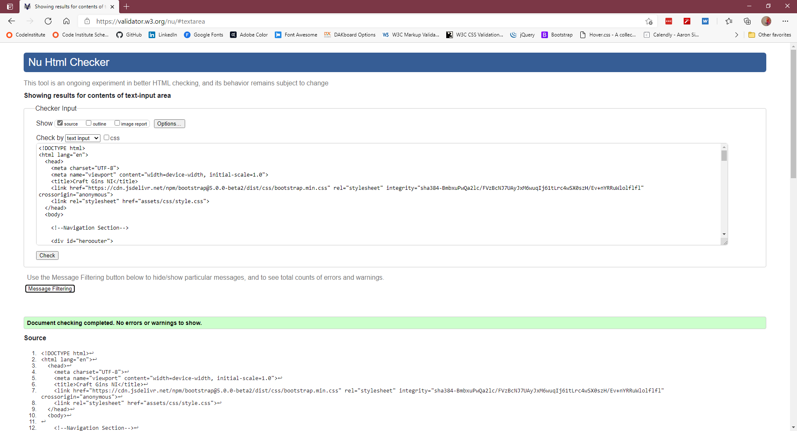

## [W3C Markup CSS Service](https://jigsaw.w3.org/css-validator/validator.html.en)

Code was validated by Direct Input by copying and pasting directly in to the validator:

style.css

- No errors found on style.css

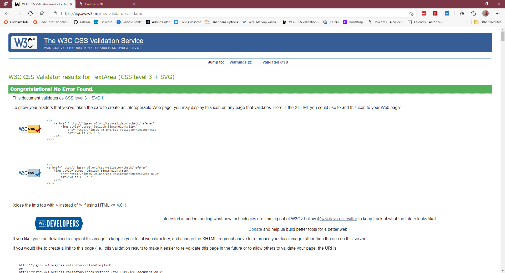

## [JS Hint Linter](https://jshint.com/)

The JavaScript code was validated through jshint by copying and pasting the code directly:

maps.js

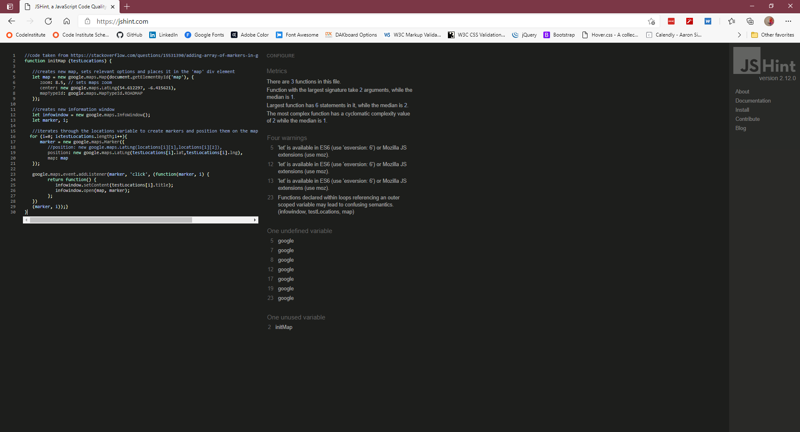

producers.js

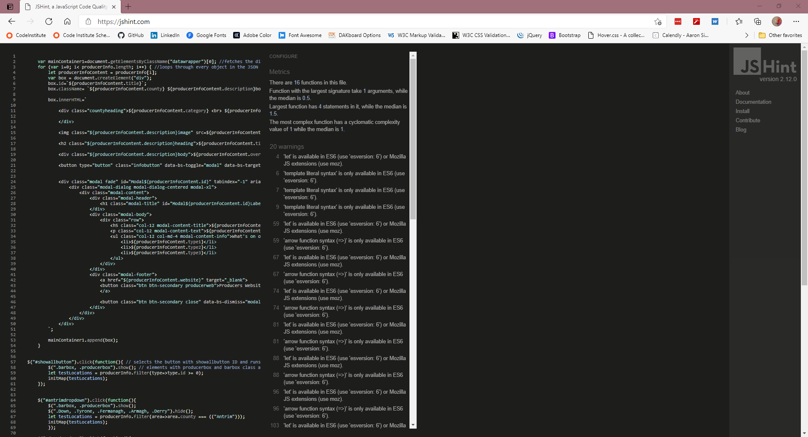

sendMail.js

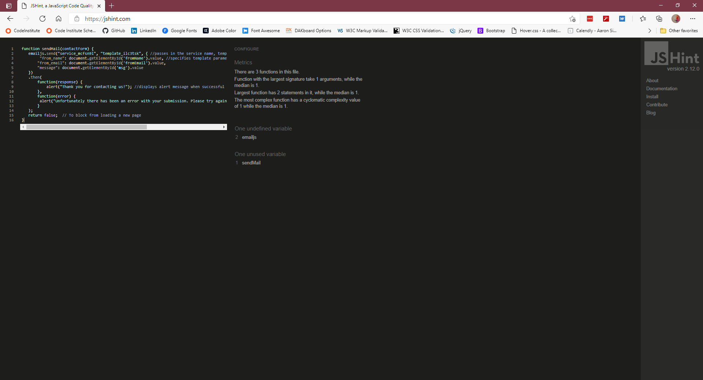

producersinfo.js

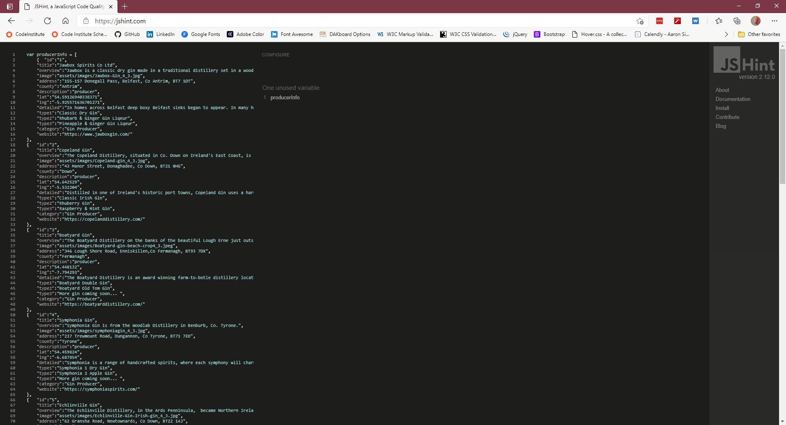

---
# **User story testing**

The user stories from the README.md file were used as a basis for testing.  For each test case the test acceptance criteria, evidence/observations and outcome have been recorded:

**1. "1. As a user I want to find out who produces craft gins in Northern Ireland so that I can experience Northern Irish craft gin"**

Acceptance criteria:
- End users should be able to find information on craft gin producers in Northern Ireland.  
- This information should be available on all device sizes.

Evidence/Observations:
- The placestogo.html page contains information on the location of each gin producer and gin joint.
- The interactive maps displays their location and the content below gives more information on the producer/bar, their address, what's available from each  

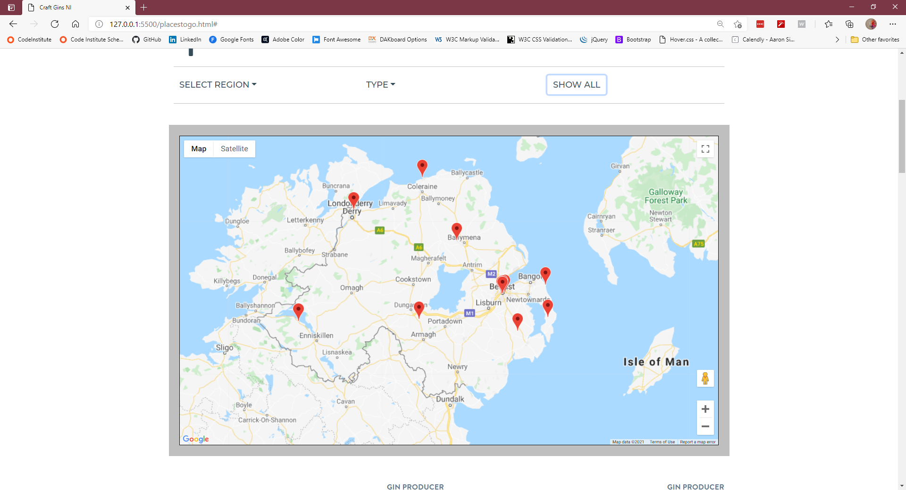

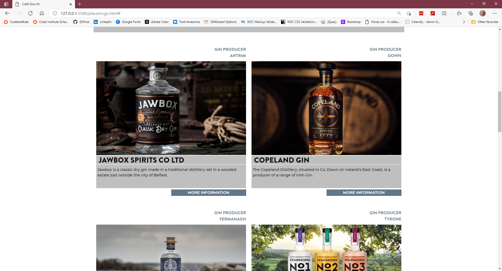

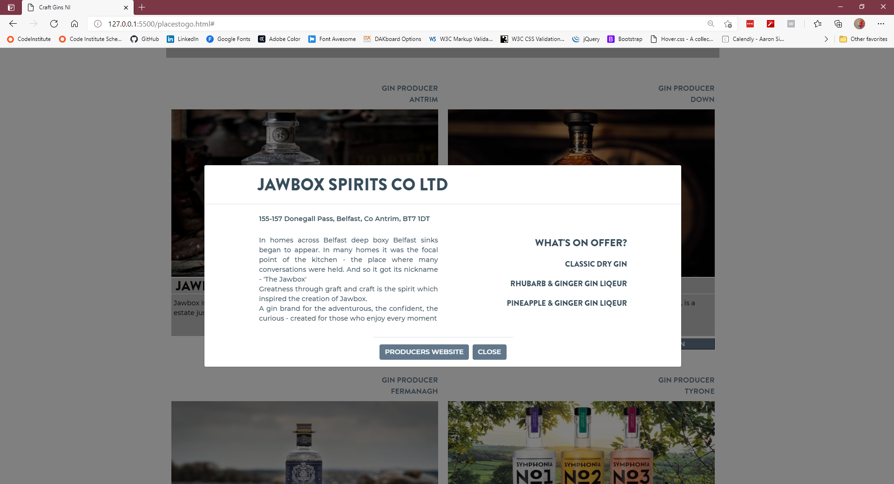

Outcome: Test successful

---

**2. "2. As a user I want to get more on information on which bars and restaurants sell craft gins so I might sample them"**

Acceptance criteria:
- End users should be able to find information on where they might be able to buy/sample gin 
- This information should be available on all device sizes.

Evidence/Observations:
- The detailed information relating to each gin producer outlines which gins types they have available - this let's the user know what gin this producer has to offer
- The detailed information on the gin joint gives information on each bar

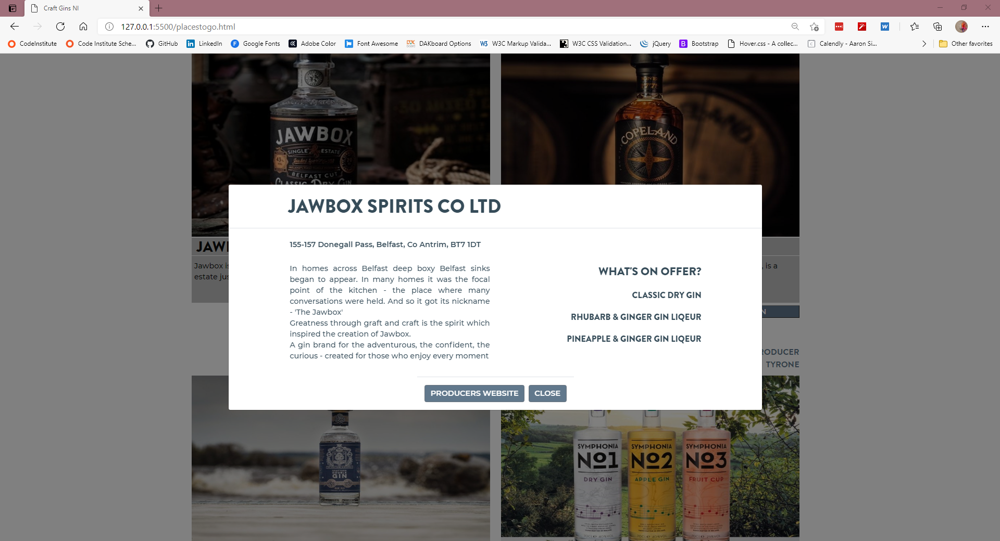

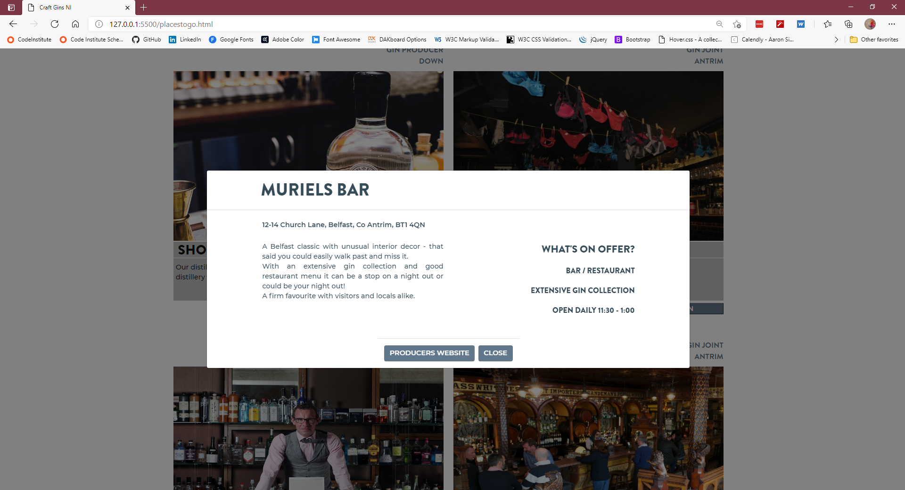

Outcome: Test successful

---

**3. "3. As a user I want the location the gin producer/bar/restaturant so I know how to locate them"**

Acceptance criteria:
- End users should be able to get the location for each gin producer / gin joint 
- This information should be available on all device sizes.

Evidence/Observations:
- The interactive map on the placestogo.html page displays the location of all/some of the establishments
- The showall button displays all gin producers / gin joints - checked that all appear on map (see screenshot)
- Selecting 'Down' from the dropdown displays all gin producers / gin joints in County Down - checked they appear on map (see screenshot)
- Selecting Gin Joints from the dropdown displays all gin joints - checked they appear on map (see screenshot)

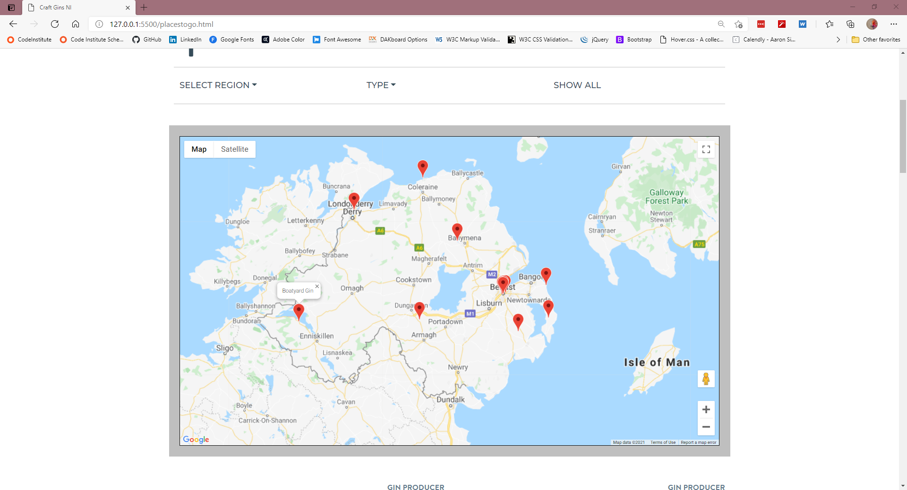

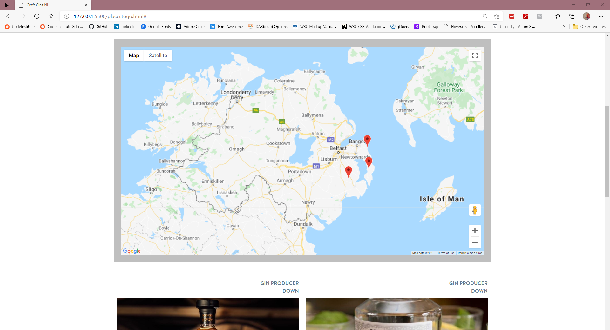

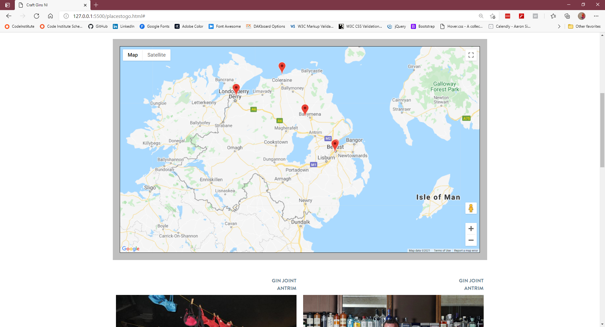

Outcome: Test successful

---

**4. "As a user I want be able to go directly to a producer/bar/restaurant website so that I can find more information/make a reservation"**

Acceptance criteria:
- End users should be able to link directly to the gin producer / gin joint website 
- This alternative means should be available on all device sizes.

Evidence/Observations:
- The more information section of each gin producer / gin joint has another button linking to the producers website
- This opens the website is a separate window

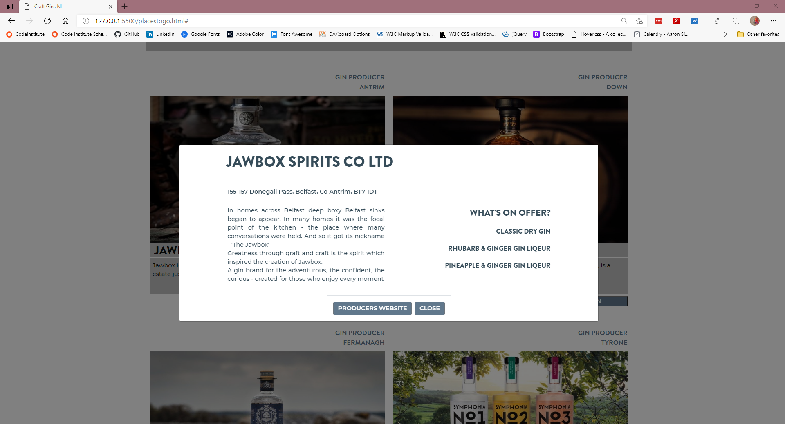

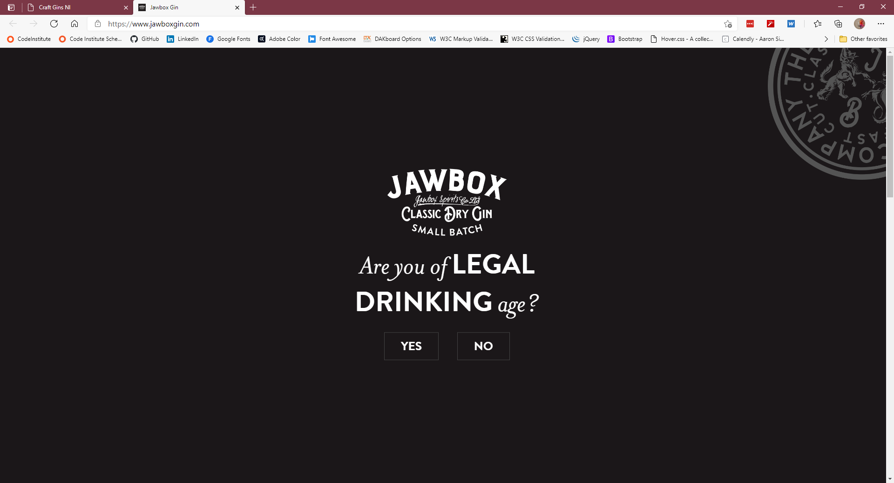

Outcome: Test successful

---

**5. "As gin producer/bar/restaurant I want to showcase my company and my products so that individuals will be encouraged to purchase their products"**

Acceptance criteria:
- The website, should display high quality content throughout 
- This information should be available on all device sizes.

Evidence/Observations:
- The evidence from the previous 4 test scripts demonstrates that information is available and accessible for users and showcases each product/establishment

Outcome: Test successful

---

TO BE COMPLETED
# **Responsiveness Testing**

The website has been designed to be responsive to different screen sizes. The following has been checked on both mobile (iPhone SE/safari) and tablet (ipad/safari browser) sized devices.

## Mobile

- Header - the navigation elements of the header section collapse under a menu button as expected. Separation markers between items (seen on larger screens) are not visible as expected. Clicking the logo returns the user to the Home page from all pages.  Clicking the Home, Gallery and Contact Us links navigate the user to the respective pages successfully
- Hero section - hero image is not displayed on mobile as expected and has been replaced with coloured background
- 3 department sections - buttons are reduced in size with smaller font sizing used; layout has been amended (2x columns of buttons side by side) with the departmental information pushed beneath the buttons filling the entire width of the screen. All buttons previously tested in User stories testing. All buttons size and align correctly
- Footer - the separation markers have been removed at this screen size as expected. Links display in 2x columns. Clicking each of the social media links opens the relevant website (Facebook, Youtube or Twitter) in new windows as expected.  The hospital link opens a new window with the P-L Services website as this is not yet linked to a larger organisation website.

## Tablet 

- Header - the navigation elements have their font size reduced as expected. Separation markers between items remain as expected. Clicking the logo returns the user to the Home page from all pages.  Clicking the Home, Gallery and Contact Us links navigate the user to the respective pages successfully
- Hero section - hero image is displayed at this screen size as expected
- 3 department sections - size of the buttons has been amended to ensure they can be clicked easily on this device size with smaller font sizing used; layout has been amended (2x columns of buttons side by side) with the departmental information pushed beneath the buttons filling the entire width of the screen. All buttons previously tested in User stories testing and size/align correctly
- Footer - Links display across the page with the font size being reduced to reflect the screen size. Clicking each of the social media links opens the relevant website (Facebook, Youtube or Twitter) in new windows as expected.  The hospital link opens a new window with the P-L Services website as this is not yet linked to a larger organisation website.

---

# **Browser testing**
The website has been tested on the following browsers:
- Firefox browser (Version 84.0 (64-bit))
- Microsoft Edge browser (Version 87.0.664.66 (Official build) (64-bit))
- Chrome Browser (Version 87.0.4280.88 (Official Build) (64-bit))
- Safari Browser
- MS Edge Mobile (Version45.11.24.5118)

---

# Bugs
The following bugs were noted during development of the P-L Services website:
- issues getting modal elements to open initially - issue due to missing javascript scripts - resolved by adding relevant javascript links/scripts
- issues getting alignment of navbar elements initially - issue involved elements not being floated/positioned correctl - resolved in style.css following review of Code Institute teaching modules/Slack
- issues over setting up Bootstrap grid to operate responsively at different screen sizes - issue was down to lack of knowledge - resolved following review of Code Institute teaching modules/Slack/Youtube videos on the topic
- issues with colouring of downloaded icon files - issued due to colour of icons being set within .svg file - resolved by amending colour setting within the .svg file following review of [Stack Overflow article](https://stackoverflow.com/questions/22252472/how-to-change-the-color-of-an-svg-element)
- issue with numbers on contact-us.html being displayed in blue on ipad - issue still being investigated 
- errors generated on testing of gallery.html relating to spaces in an image name - resolved by renaming files in GitPod and amended path within gallery.html
- errors generated on testing of style.css relating to margins being set as Margin: 20 auto - resolved by amending relevant lines in style.css to be Margin: 20px auto; 
- errors generated on testing of contact-us.html relating to use of datetime type and associated placeholder not being legal - resolved by amended type in contact-us.html